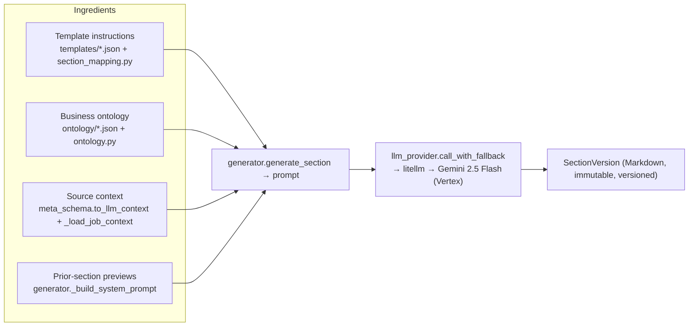
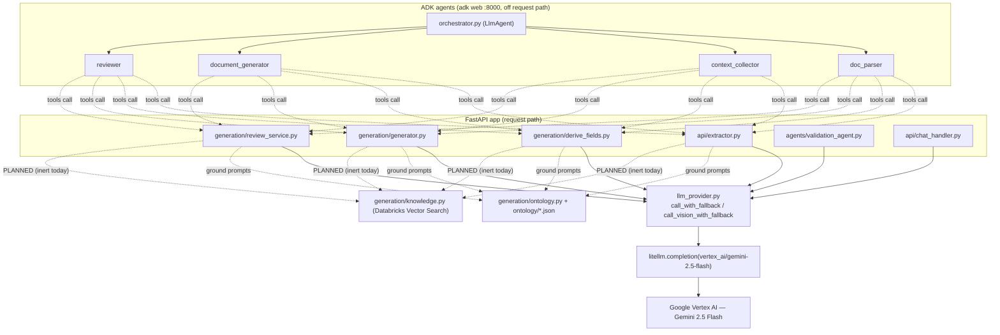
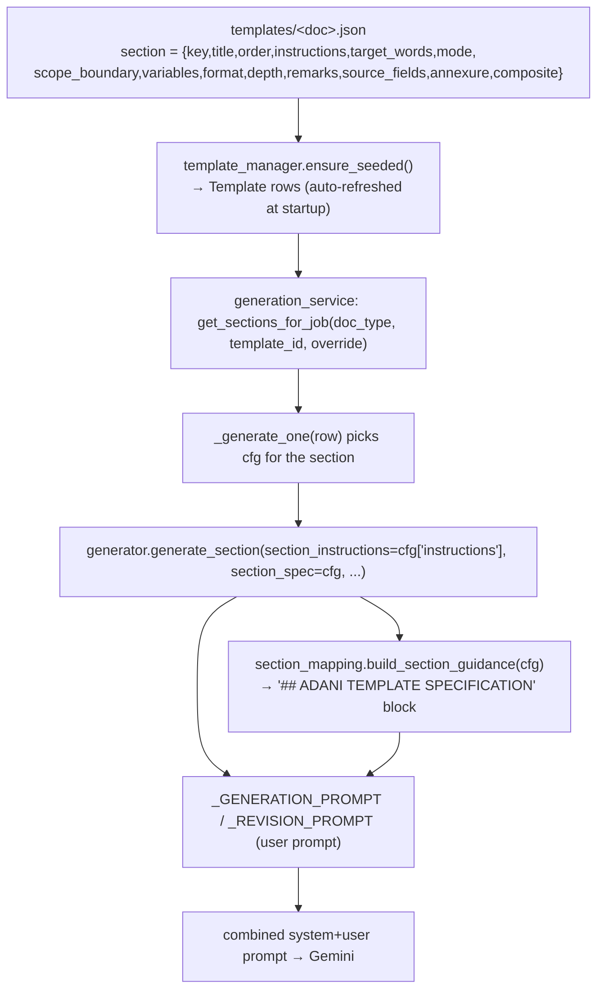
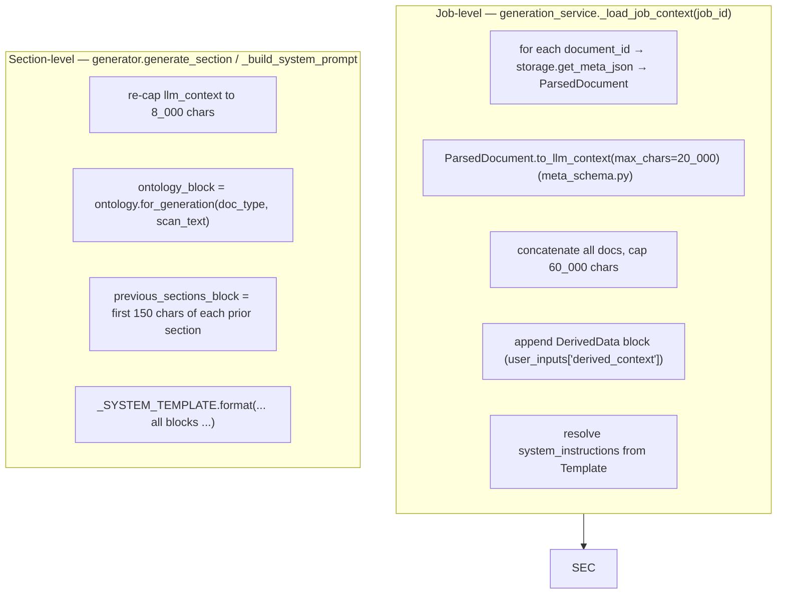
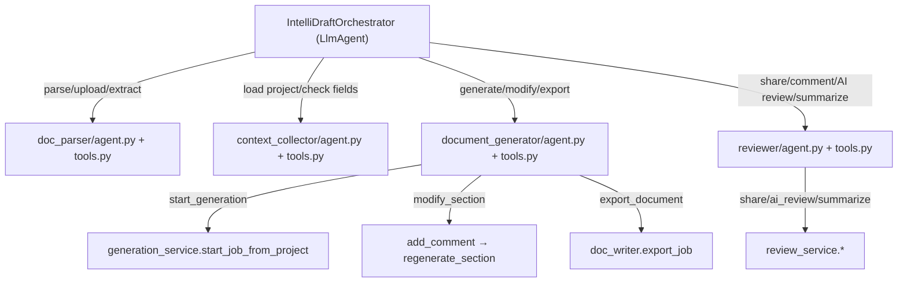
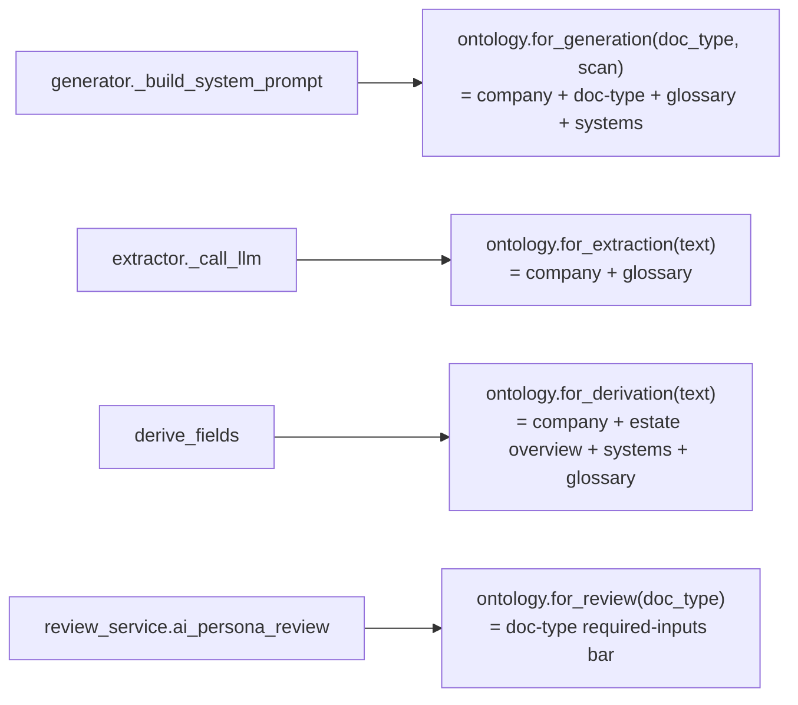
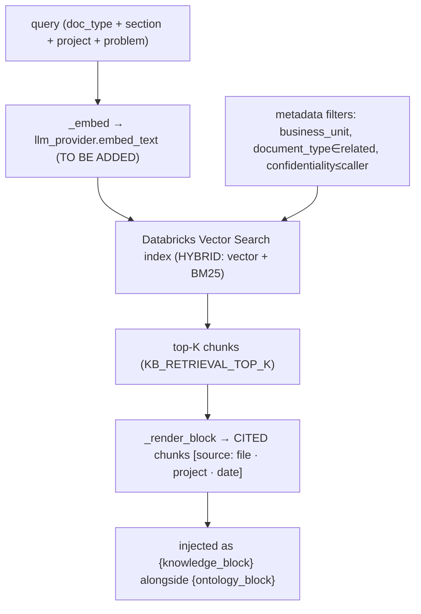
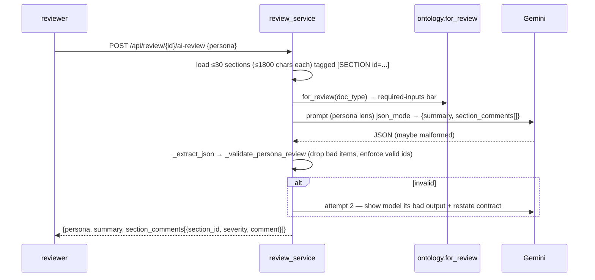
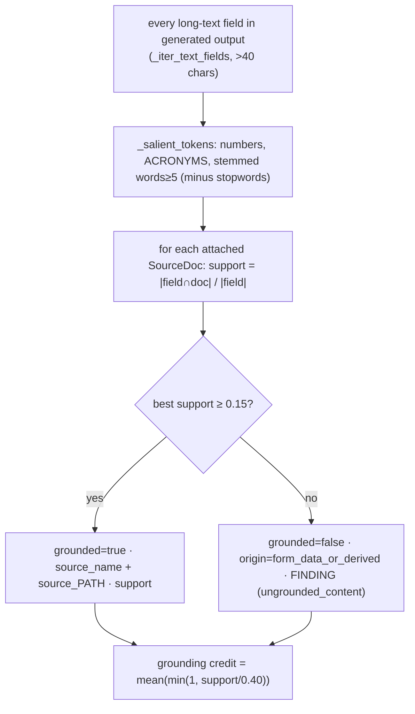

# IntelliDraft — GenAI Design (Detailed)

> Deep-dive into the AI/LLM layer: architecture, every flow, how instructions and context are built
> (with file + function references), all agents, ontology grounding, the planned AI-search (RAG)
> layer, persona & review AI, the comment-update loop, and validation. Every claim is traceable to a
> file and function under `Data_Ingestion/`.

---

## 0. TL;DR mental model

IntelliDraft is a **prompt-assembly engine over Gemini 2.5 Flash**. For each document section it
builds one big prompt from four ingredients — **template instructions**, **business ontology**,
**source-document context**, and **coherence previews of prior sections** — sends it to Gemini via a
single choke-point (`llm_provider.call_with_fallback`), stores the Markdown as an immutable
`SectionVersion`, and repeats **in parallel waves**. Everything else (extraction, derivation, review,
validation, chat) is the same pattern with a different prompt.



---

## 1. AI architecture overview

There are **two AI surfaces** that share the same underlying services and the same LLM:

| Surface | Entry | On the request path? | Purpose |
|---|---|---|---|
| **Direct-call services** | `llm_provider.call_with_fallback()` | ✅ Yes (FastAPI) | Extraction, derivation, section generation, review, validation, chat impact analysis |
| **Google ADK multi-agent** | `agents/orchestrator.py` (`adk web`) | ❌ No (separate `:8000` chat UI) | A conversational front-end whose *tools* call the same services |



### 1.1 The single LLM choke point — `llm_provider.py`
Every LLM call routes through **`call_with_fallback(messages, *, max_tokens, timeout, log_prefix, json_mode)`** → returns `(text, "gemini_vertex")`.

- **Model:** `vertex_ai/${GEMINI_VERTEX_MODEL}` (default `gemini-2.5-flash`), auth = GCP service-account
  JSON (`key.json`) passed as `vertex_credentials` to `litellm.completion`.
- **Retries (`_completion_with_retry`, tenacity):** 3 attempts, exponential jitter (2→20s),
  **transient-only** (`_is_transient`: HTTP 408/429/500/502/503/504 or
  Timeout/APIConnection/RateLimit/InternalServer/ServiceUnavailable). Everything else fails fast.
- **`json_mode=True`** → Vertex `response_format={"type":"json_object"}`. Used by every JSON-output call
  (extractor, persona review, validation judge). Prevents Gemini's occasional prose-on-long-prompt replies.
- **Vision:** `call_vision_with_fallback(text_prompt, base64_data, mime_type, …)` wraps an image message.
- ⚠️ **There is no non-Gemini fallback in code** — a failure raises `RuntimeError` (routes → HTTP 502).

---

## 2. The end-to-end GenAI flow

```mermaid
sequenceDiagram
    autonumber
    participant U as Client
    participant API as main.py
    participant PAR as parsers + vision_analyzer
    participant EX as extractor / derive_fields
    participant GS as generation_service
    participant GEN as generator
    participant ONT as ontology
    participant LLM as Gemini
    participant DB as DB

    U->>API: POST /api/upload
    API->>PAR: parse_document → ParsedDocument
    PAR->>LLM: call_vision_with_fallback (per image, if VISION_ENABLED)
    PAR->>DB: persist meta.json (storage)

    U->>API: POST /api/extract-project-data {document_ids}
    API->>EX: extract_project_data
    EX->>ONT: for_extraction(text)  (glossary + org)
    EX->>LLM: JSON extraction (json_mode) → 12 intake fields

    U->>API: POST /api/projects/{id}/derive-fields
    API->>EX: derive_fields
    EX->>ONT: for_derivation(text) (estate + glossary)
    EX->>LLM: JSON derivation (json_mode) → 12 DerivedData fields

    U->>API: POST /api/generate/project/{id}
    API->>GS: start_job_from_project → start_job → _run_generation_job
    loop each wave (GENERATION_CONCURRENCY sections)
      GS->>GEN: generate_section(...)
      GEN->>ONT: for_generation(doc_type, scan) → ontology_block
      GEN->>LLM: prose Markdown (no json_mode)
      GEN->>DB: SectionVersion v1 + atomic completed_sections++
    end
    GS->>DB: job=completed; pre-warm preview

    U->>API: POST /api/generate/{job_id}/validate
    API->>VAL: ValidationAgent.evaluate (grounding + weighted score)
```

Files in play: `main.py` (routes) → `api/extractor.py`, `generation/derive_fields.py`,
`generation/generation_service.py`, `generation/generator.py`, `generation/ontology.py`,
`agents/validation_agent.py`, `llm_provider.py`.

---

## 3. How INSTRUCTIONS flow (template → prompt)

Instructions are **data**, not code. They live in the per-doc-type template JSON and flow into the
prompt through a small, well-defined path.



Key functions:
- **`template_manager.get_sections_for_job(document_type, template_id, sections_override)`** — resolves
  the ordered section list. Guards against a stale/default *system* `template_id` that mismatches the
  doc type (the bug that once made every doc render as a BRD). Falls back to a single "content" section
  for unknown types.
- **`section_mapping.build_section_guidance(section)`** — turns the section's optional spec fields into
  the authoritative `## ADANI TEMPLATE SPECIFICATION` block:
  - `scope_boundary` → **"MUST NOT INCLUDE"** (stops sections bleeding into each other)
  - `variables` → exact table column names (enforced as the header row for `format:"Table"`)
  - `format` (Text/List/Table/Form/Header), `depth` (Detailed/Short), `remarks`, `source_fields`,
    `annexure.reference_text`
- **`generator._GENERATION_PROMPT` / `_REVISION_PROMPT`** — the user-turn templates. Revision mode is
  used when an `edit_comment` + `previous_content` are supplied (regeneration).

### 3.1 Static vs generate instructions (non-obvious)
A section can set **`mode:"static"`**. In `generation_service._generate_one`, a static section
**bypasses the LLM**: its `static_content` is inserted verbatim with `{{placeholders}}` filled by
`_fill_placeholders(text, user_inputs)` (unknown tokens → `__________`; NIT defaults
`client_name`/`organisation`/`purchaser` → AEML). It still persists as a normal `SectionVersion`
(`trigger_type="static"`). Used for legal boilerplate / tender forms.

### 3.2 Composite sections
A section with `composite:true` + `subsections:[…]` instructs the model to produce the parent **and**
all sub-sections in one continuous block under their own Markdown headings (e.g. BRD §4 with §4.1–4.6).
This is expressed entirely in the section's `instructions` string in the template JSON.

---

## 4. How CONTEXT is built (file + function reference)

Context assembly happens in two layers: **job-level** (once per job) and **section-level** (once per
section call).



**Function-by-function:**

1. **`ParsedDocument.to_llm_context(max_chars)`** (`models/meta_schema.py`) — flattens parsed elements
   in page/slide order into text. Images become `[IMAGE [type]: <ai_description>  Key components: …]`
   tags; tables become Markdown; each element carries a `<!-- ref -->` (e.g. `text#txt_0001`).
2. **`generation_service._load_job_context(job_id)`** — loads **all** attached `document_ids`, caps each
   at 20K chars, joins with `--- ` separators, caps the total at **60K chars**, then appends the AI-derived
   analysis (`derived_context`) and resolves the template's `system_instructions`.
3. **`generator.generate_section(...)`** — re-caps `llm_context` to **8,000 chars** per section call
   (predictable latency), then calls `_build_system_prompt`.
4. **`generator._build_system_prompt(...)`** assembles `_SYSTEM_TEMPLATE` in this order:
   - Project info (name, doc type, audience, stakeholders, language)
   - **`{ontology_block}`** (see §6)
   - Business context / project description / additional + template style instructions
   - **Source document content** (the 8K context)
   - **"SECTIONS ALREADY WRITTEN"** — the first **150 chars** of each prior section (coherence signal
     that stays cheap as the document grows; this is *why* wave-parallel generation is quality-neutral)
   - Strict FORMATTING + CONTENT-QUALITY rules (Markdown tables need header rows; expand Adani acronyms
     on first use; prefer real AESL systems; no "TBD"/"Lorem ipsum"; enterprise tone; output only the
     section)
5. **Output budget:** `_estimate_max_tokens(target_words) = clamp(target_words×6, 5000, 16000)`.

The **exact prompt** sent to Gemini is stored on `SectionVersion.generation_prompt` — the best
debugging artifact for "why did this section come out this way".

---

## 5. The agents — what each does and how

### 5.1 Direct-call "agents" (the real workhorses — on the FastAPI path)

| "Agent" (module) | Function(s) | Input → Output | Ontology | json_mode |
|---|---|---|---|---|
| **Extractor** `api/extractor.py` | `extract_project_data` → `_call_llm` | doc text → 12 intake fields (+ missing-field analysis) | `for_extraction` | ✅ |
| **Deriver** `generation/derive_fields.py` | derive → LLM | intake + doc text → 12 `DerivedData` fields | `for_derivation` | ✅ |
| **Generator** `generation/generator.py` | `generate_section` | section instr + context → Markdown | `for_generation` | ❌ (prose) |
| **Vision** `parsers/vision_analyzer.py` | `analyze_image` | image bytes → `{description, image_type, key_elements}` | — | (image) |
| **Reviewer** `generation/review_service.py` | `ai_persona_review`, `summarize_for_author` | sections → persona comments / summaries | `for_review` | ✅ / plain |
| **Validator** `agents/validation_agent.py` | `ValidationAgent.evaluate` | generated + sources → score + provenance | — | ✅ (optional judge) |

### 5.2 ADK multi-agent system (optional `adk web` surface)

Root: **`agents/orchestrator.py`** — an `LlmAgent` (`root_agent`) that routes by reading each
sub-agent's `description`. Model chosen by `agents/_model.py get_agent_model()` → Gemini 2.5 Flash.
Shared state flows through the ADK `InvocationContext` (`project_id`, `job_id`, `parsed_document_ids`, …).



**`document_generator/tools.py`** is the clearest example — 6 async tools, each a thin wrapper:
`start_generation` (→ `start_job_from_project`, stashes `job_id`/`project_id` in `tool_context.state`),
`get_job_status`, `list_sections`, `get_section_content`, **`modify_section`** (the chatbot core:
`add_comment(edit_request) → regenerate_section` → new version, "only that section changes"),
`export_document` (→ `doc_writer.export_job`). **No business logic lives in the tools** — they delegate.

> Note: the **in-app** Document Chat Studio (`api/chat_handler.py`) is *not* an LLM agent — it uses
> keyword classification and calls the same services. The ADK agents are an alternative front-end.

---

## 6. How ONTOLOGY is included (grounding)

Single module: **`generation/ontology.py`**, backed by the business-owned pack in
`Data_Ingestion/ontology/` (loaded once via `@lru_cache _load()`; **restart to refresh**).

| Pack file | Used for |
|---|---|
| `adani_description.json` | Adani Group / AESL / AEML entity framing (`company_context`) |
| `document_descriptions.json` + `workflow.json` | doc-type purpose, inputs, owner, chain position, risk (`document_context`) |
| `terminology.json` (549 terms) | acronym/domain glossary (`glossary_block`) |
| `technical_landscape.json` (~130 tools) | AESL system estate (`tech_landscape_block`) |
| `key_regulations.json` | MERC/BEE/DFPO/LIS references |

**The core discipline is SELECTIVE injection — never dump whole files.**
- `glossary_block(scan_text, limit)` matches only terms that appear in the call's text (fast substring
  pre-reject → word-boundary regex; ~10ms on a 60K scan; capped ~35–40 terms, longest-first).
- `tech_landscape_block(scan_text, limit, include_overview)` injects only mentioned systems (+ optional
  domain overview).
- `document_context(document_type)` injects the doc type's purpose, predecessor in the
  **BRD→NDPR→NFA→NIT→RFP** chain, required inputs, reviewers, and "risk if weak".

Four assemblies, one per prompt site (all fail-soft to `""` — a broken ontology never breaks generation):



Where injected: `generator.py` builds `scan_text` from project name + problem + description + additional
instructions + derived context + llm_context, then calls `for_generation`. The block lands in the
`{ontology_block}` slot of `_SYSTEM_TEMPLATE`.

---

## 7. How AI SEARCH (RAG) will be included

> **Status today: `generation/knowledge.py` is a complete SCAFFOLD but INERT.** No prompt site imports
> it, and it depends on `llm_provider.embed_text` which **does not exist yet**. All functions are gated
> by `KB_RETRIEVAL_ENABLED` (default `false`) and fail-soft to `""`. This section documents the intended
> design *and the exact steps to activate it*.

### 7.1 Intended architecture (Databricks Vector Search)



Design rules already coded in `knowledge.py` (mirror `ontology.py`):
- **Fail-soft everywhere** — missing config/index/creds → `""`; generation must work exactly as today
  when the KB is off.
- **Token discipline** — block capped ~1,500 tokens (`_BLOCK_CHAR_CAP=6000`), per-chunk `_CHUNK_CHAR_CAP=1200`.
- **Access control in the query** — `_build_filters` restricts to `confidentiality_level ≤ caller`
  and (optionally) `business_unit`; document types expand to the chain-related set
  (`_RELATED_DOC_TYPES`, e.g. NFA → [NFA, NDPR, NIT]).
- **Every chunk cited** — `_cite(chunk)` = `filename · project · date`, and the prompt tells the model
  to **keep the `[source: …]` tag** for anything it lifts, feeding the validation agent's provenance.
- Four assemblies mirroring ontology: `for_generation` (section-aware), `for_extraction`,
  `for_derivation`, `for_review`.

### 7.2 Activation checklist (what's missing)
1. **Add `embed_text(text) -> list[float]`** to `llm_provider.py` (a Vertex/Gemini embeddings call —
   a different model family from chat). `knowledge._embed` already imports it.
2. **Provision** a Databricks Vector Search endpoint + index (chunks with columns `chunk_id,
   document_id, chunk_text, section_title, document_type, project_name, source_document_path,
   created_date, business_unit, confidentiality_level`). Build an ingestion job that chunks + embeds
   prior approved documents.
3. **Set env:** `KB_RETRIEVAL_ENABLED=true`, `KB_ENDPOINT_NAME`, `KB_INDEX_NAME`, `KB_RETRIEVAL_TOP_K`,
   `KB_CONFIDENTIALITY_DEFAULT`.
4. **Wire the four call sites** — import and concatenate the `knowledge.for_*` block next to the
   existing `ontology.for_*` block:
   - `generator._build_system_prompt` → add `knowledge.for_generation(doc_type, section_title, user_inputs, scan)` into the prompt (a new `{knowledge_block}` slot).
   - `extractor._call_llm`, `derive_fields`, `review_service.ai_persona_review` similarly.
5. **(Optional) rerank** — a cross-encoder pass after `hybrid_search` (design note in the file).

Once wired, generation is grounded not just in the *static* ontology but in *actual prior Adani
documents*, with citations that the validation agent can verify.

---

## 8. Persona & Review AI (`generation/review_service.py`)

### 8.1 Personas
5 system personas (`db.DEFAULT_PERSONAS`: Project Manager, Technical Reviewer, Business Analyst,
Compliance Officer, Financial Auditor), seeded on first use (`ensure_personas_seeded`, idempotent).
Users may add custom personas (`create_persona`, `owner_email`); system personas can't be edited/deleted.

### 8.2 AI persona review — `ai_persona_review(review_id, persona, instructions)`

Hardening: `json_mode=True`, a **corrective retry** (feeds the model its own malformed output),
`_extract_json` (fence-tolerant), and `_validate_persona_review` (shape + valid `section_id` +
severity normalization; individual bad items dropped, not fatal). **Nothing is persisted** until the
reviewer keeps comments via **`keep_ai_comments`** (source=`ai`, one aggregated notification).

### 8.3 Author summaries — `summarize_for_author(review_id, personas, force)`
Persona-wise plain-text summaries of **all** reviewer feedback. **Fingerprint-cached**: each summary
stores `comments_fingerprint = _comments_fingerprint(comments)` (SHA-256 of ids + updated_at + text
head). If comments are unchanged, the cached summary is returned **without calling the LLM** (unless
`force=True`).

### 8.4 Review lifecycle rollup — `respond(review_id, reviewer_email, action)`
Worst-wins: any `rejected` → rejected; else any `revision_requested` → revision_requested; else all
`accepted` → approved (review completed); else under_review. Writes `GenerationJob.review_status` and
emits an in-app notification to the author (`_notify`).

---

## 9. How COMMENT UPDATE works (review comment → new section version)

This is the bridge from the review workflow back into generation — `review_service.apply_comment_to_section`.

```mermaid
sequenceDiagram
    autonumber
    participant A as Author
    participant RS as review_service
    participant GS as generation_service
    participant PS as preview_service
    participant LLM as Gemini
    A->>RS: POST /api/review/comments/{comment_id}/apply
    RS->>RS: load ReviewComment (text, persona, author, section anchor)
    RS->>GS: add_comment(section_id, "[Review feedback from X as persona]: <text>", edit_request)
    RS->>GS: regenerate_section(section_id, comment_id)
    GS->>GS: mark section 'generating'; load context; build previous_sections
    GS->>LLM: generate_section(edit_comment=..., previous_content=current) [REVISION prompt]
    GS->>DB: new SectionVersion (version+1, trigger=ai_regeneration); mark comment addressed
    GS->>PS: invalidate_preview_cache(job_id)
    RS->>DB: ReviewComment.status='resolved'; applied_section_comment_id set
    RS->>A: notify comment author "your comment was applied"
```

Key point (a historically fixed bug): **`regenerate_section` MUST call
`invalidate_preview_cache(job_id)`** — otherwise the DB has the new version but `/preview/html` keeps
serving stale HTML ("edits don't show up"). Manual edits (`update_section_content`) and chat modifies
go through the same invalidation.

### 9.1 The comment/edit surfaces (all converge on `regenerate_section` or a new version)
| Surface | Path |
|---|---|
| Review comment "Apply" | `apply_comment_to_section` → `add_comment` → `regenerate_section` |
| Chat "modify" | `chat_handler._execute_modify` → `add_comment` → `regenerate_section` |
| ADK `modify_section` tool | `add_comment` → `regenerate_section` |
| Section comment + regenerate endpoint | `POST …/section/{id}/regenerate` → `regenerate_section` |
| Manual inline edit | `PATCH …/section/{id}` → `update_section_content` (new `manual_edit` version) |
| Whole-document HTML edit | `POST …/preview/save` → `save_edited_html` (`manual_html` snapshot, verbatim) |

### 9.2 Preview & change detection (`generation/preview_service.py`)
- `get_or_submit_preview(job_id)` → serves the newest **`manual_html`** snapshot if it's newer than
  every section (`_latest_manual_html`), else `render_document_html(job_id)` (markdown2 + `doc_style`
  CSS, each section wrapped in `<section data-section-id>` markers, "N. Title" numbering).
- `detect_changed_sections(job_id, submitted_html)` diffs submitted vs current per marker (bs4) — used
  by `save_edited_html` to report which sections the editor touched.
- `invalidate_preview_cache(job_id)` clears the in-process `_preview_cache`.

---

## 10. How VALIDATION is created (`agents/validation_agent.py`)

A **deterministic-by-default** QA scorer (offline; `use_llm=True` adds a Gemini semantic judge). Runtime
entry: **`POST /api/generate/{job_id}/validate`** (409 if the job isn't completed).

### 10.1 Score model
```
score = Σ(metric × weight)/Σweights
weights = correctness 40 · completeness 20 · format 15 · edge_cases 15 · robustness 10
PASS iff score ≥ 80 AND no CRITICAL finding
```

### 10.2 Source-document provenance (the standout feature) — `_grounding`

- With `ground_truth=None` (the runtime `/validate` mode), **correctness = grounding credit** — i.e.
  "how much of this generated document traces back to its source documents". The report's `provenance`
  list carries the source **name and path** per field.
- With a `ground_truth`, correctness is a recursive field-by-field diff (`_score_correctness`) blended
  70/30 with grounding; long strings compared via `text_similarity` (stemmed token-F1 + difflib) and,
  if `use_llm`, a Gemini semantic judge (`_semantic`, json_mode).
- `completeness` flags every missing/empty ground-truth field (required ones → CRITICAL);
  `format` checks type match; `edge_cases`/`robustness` grade supplied `EdgeCheck`s.

### 10.3 Data types
`Finding(category, path, message, severity)`, `EdgeCheck`, `SourceDoc(name, path, content)`,
`Provenance(field, grounded, support, source_name, source_path, origin)`, `Report(score, metrics,
findings, passed, summary, provenance).to_dict()`. Also usable as a CLI:
`python tests/validation_agent.py generated.json truth.json`.

---

## 11. Reliability, cost & token levers (summary)

| Lever | File · function | Effect |
|---|---|---|
| Wave parallelism `GENERATION_CONCURRENCY` (6) | `generation_service._run_generation_job` | ~concurrency-fold wall-clock cut |
| 150-char prior-section previews | `generator._build_system_prompt` | Coherence stays cheap → parallelism is quality-neutral |
| 8K/20K/60K context caps | `generator` / `_load_job_context` | Predictable latency |
| Selective ontology (~1K tokens) | `ontology.py` | Never dumps 549 terms / 25K-token estate |
| Short-table retry (once) | `_generate_one` | Fills truncated tables |
| json_mode on all JSON calls | `llm_provider` + call sites | No prose-on-JSON failures |
| tenacity transient-only retry | `llm_provider._completion_with_retry` | Rides out 429/5xx, fails fast otherwise |
| Summary fingerprint cache | `review_service.summarize_for_author` | Skips unchanged re-summaries |
| Preview pre-warm + cache | `preview_service.pregenerate_preview` | HTML ready before first poll |

---

## 12. Where to look (quick file index)

| Concern | File · key functions |
|---|---|
| LLM access | `llm_provider.py` · `call_with_fallback`, `call_vision_with_fallback` (+ `embed_text` TODO) |
| Section prompt | `generation/generator.py` · `generate_section`, `_build_system_prompt`, `_estimate_max_tokens` |
| Instruction spec block | `generation/section_mapping.py` · `build_section_guidance` |
| Templates | `generation/template_manager.py` · `get_sections_for_job`; `templates/*.json` |
| Context build | `generation/generation_service.py` · `_load_job_context`; `models/meta_schema.py` · `to_llm_context` |
| Ontology | `generation/ontology.py` · `for_generation/for_extraction/for_derivation/for_review` |
| AI search (RAG) | `generation/knowledge.py` · `hybrid_search`, `for_*` (INERT — see §7) |
| Extraction/derivation | `api/extractor.py`, `generation/derive_fields.py` |
| Review & personas | `generation/review_service.py` · `ai_persona_review`, `summarize_for_author`, `apply_comment_to_section`, `respond` |
| Validation | `agents/validation_agent.py` · `ValidationAgent.evaluate`, `_grounding` |
| Preview/comment update | `generation/preview_service.py` · `get_or_submit_preview`, `invalidate_preview_cache`, `detect_changed_sections` |
| ADK agents | `agents/orchestrator.py`, `agents/*/agent.py`, `agents/*/tools.py`, `agents/_model.py` |
