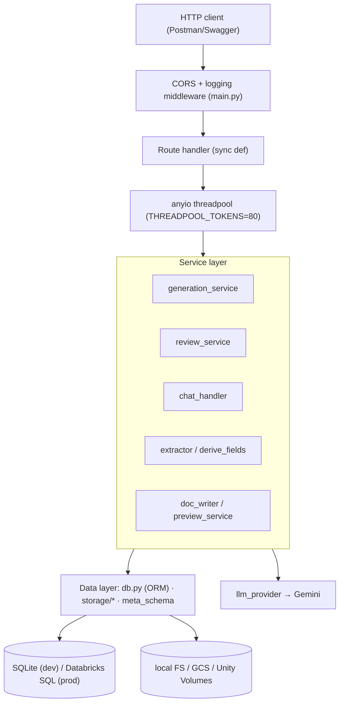
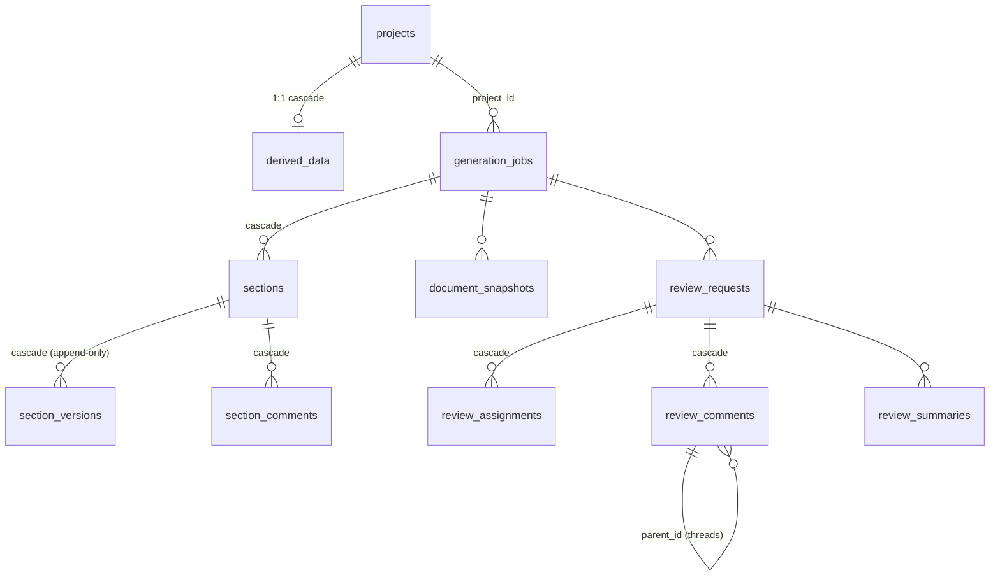
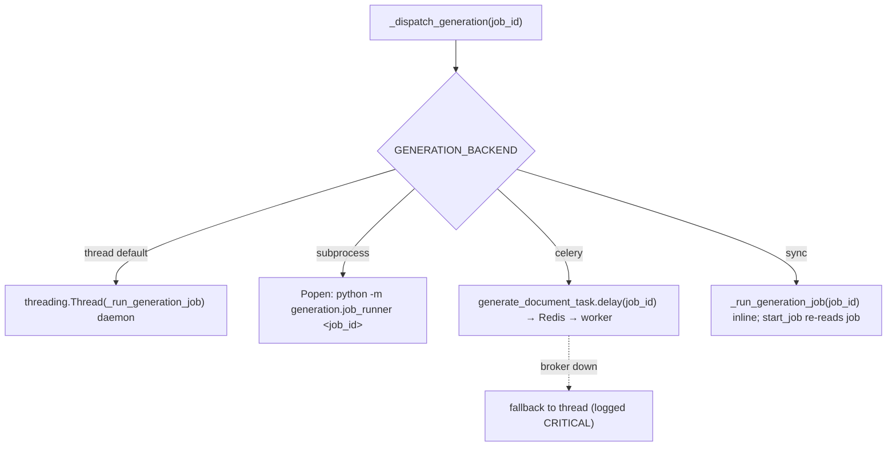
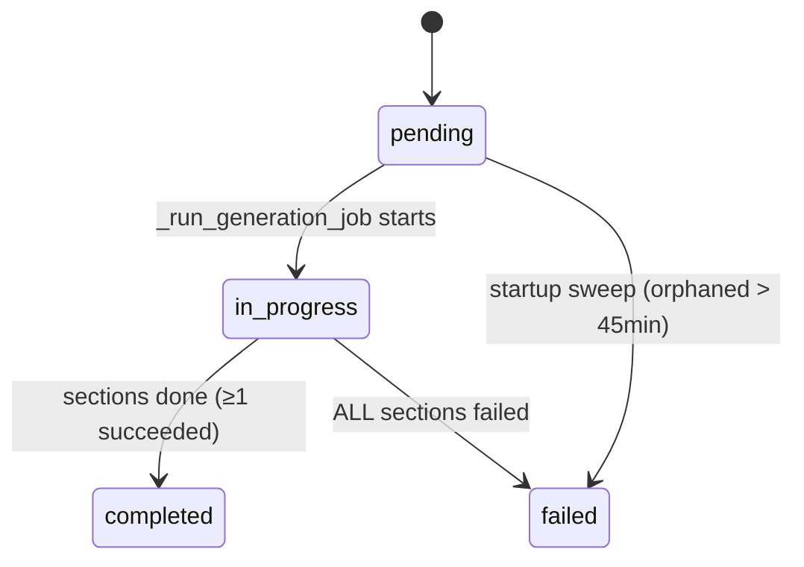
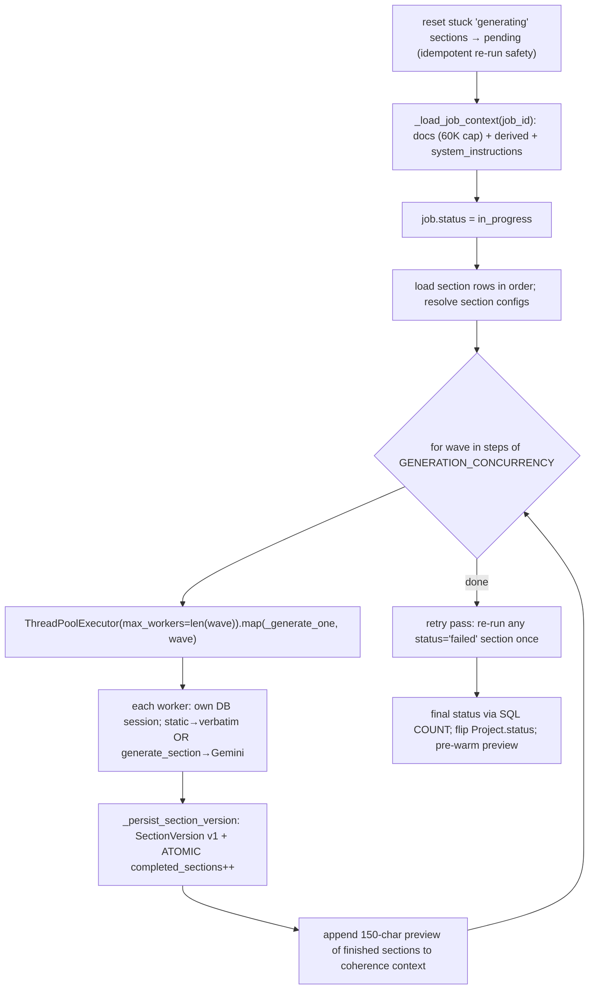

# IntelliDraft — Backend Design (Detailed)

> Deep-dive into the backend: architecture and request lifecycle, the full database model, the API
> surface, and — in detail — how generation **jobs** and the **parallel pipeline** are built. Every
> claim is traceable to a file/function under `Data_Ingestion/`.

---

## 1. Backend architecture & request lifecycle

One **FastAPI** app (`Data_Ingestion/main.py`, ~64 routes) over a service layer, a SQLAlchemy data
layer, and pluggable object storage. No microservices; an *optional* Celery worker for durable jobs.



### 1.1 Sync-by-design routes (critical invariant)
Every route is a plain **`def`** (not `async def`). FastAPI runs sync routes in an **anyio threadpool**
(sized in the lifespan to `THREADPOOL_TOKENS`, default 80). Because the service layer blocks (SQLAlchemy,
litellm), sync routes keep those blocking calls **off the event loop**. The **only** `async def` route is
the SSE stream (`GET /api/generate/{job_id}/stream`), which uses `asyncio.sleep` + `run_in_threadpool`
for DB reads so it holds no thread while idle.

> **Rule:** do NOT convert routes to `async def` while services block.

### 1.2 Middleware & error contract (`main.py`)
- `cors_and_log` — stamps CORS headers on every response, short-circuits `OPTIONS /api/*` with 204,
  logs `METHOD path -> status`.
- `RequestValidationError` handler → `{"error": …}` with **400** (not FastAPI's default 422).
- `J(data, status)` helper wraps `JSONResponse`.

### 1.3 Application lifespan (`_lifespan`)
- **Startup:** resize anyio threadpool; **orphaned-job sweep** — jobs `pending`/`in_progress` older
  than `STALE_JOB_MINUTES` (45) are marked `failed` (thread jobs don't survive a restart).
- **Shutdown:** dispose the DB engine (flush SQLite WAL).

### 1.4 Wiring (no DI framework)
Lazy module singletons: `db.get_engine()`, `storage.get_storage_service()`, `main._get_store()`,
`ontology._load()` / `knowledge._index()` (`@lru_cache`). Function-scoped imports inside handlers break
import cycles and keep cold-start cheap.

---

## 2. Database model

All 13 models in **`generation/db.py`** (SQLAlchemy 2.0 declarative). Backend chosen by env — see §6.



### 2.1 Table summary
| Table | PK | Role |
|---|---|---|
| `generation_jobs` | job_id | one generate request; `status`, `review_status`, counters, `user_inputs_json` |
| `sections` | section_id | section within a job; `current_version`, `version_hash` |
| `section_versions` | version_id | **immutable, numbered** Markdown; `trigger_type`, `generation_prompt`, `edited_by` |
| `section_comments` | comment_id | edit-request that drives regeneration |
| `document_snapshots` | snapshot_id | checkpoints; `manual_html` stores raw edited HTML verbatim |
| `templates` | template_id | seeded from `templates/*.json`; system auto-refresh at startup |
| `projects` | project_id | intake form (~40 cols incl. 12 Figma fields); lifecycle `status` |
| `derived_data` | project_id | 1:1 AI-derived 12 fields |
| `chat_sessions` | session_id | chat state (`messages_json`, `pending_json`, `phase`) |
| `users` / `personas` | user_id / persona_id | reviewer identity / AI reviewer profiles |
| `review_requests` / `review_assignments` / `review_comments` / `review_summaries` | … | review workflow (threaded comments, cached summaries) |
| `notifications` | notification_id | in-app bell, keyed by `recipient_email` |

Full column-level reference: [README_DATABASE.md](README_DATABASE.md).

### 2.2 Serialization convention (DB-first)
ORM `to_dict()` / `to_ingested_dict()` / `to_full_dict()` are the API serializers. **POST/PATCH return
only ids/counts**; clients read business data back via GET endpoints.

### 2.3 Engine & migrations (`db.py`)
- `_make_engine()` — SQLite: **QueuePool** (never StaticPool), `check_same_thread=False`, driver
  `timeout=30`, WAL + `busy_timeout=30000` + `synchronous=NORMAL` + `foreign_keys=ON`. Prod: explicit
  `DATABASE_URL` or Databricks OAuth (`_make_databricks_oauth_engine`, service-principal M2M, no PAT).
- `get_engine()` → `create_all()` (missing tables) + **`_migrate_sqlite_columns()`** (SQLite-only
  auto-`ALTER TABLE ADD COLUMN` for new nullable model columns; identifier allow-listed vs
  `^[A-Za-z_][A-Za-z0-9_]*$`). **Prod needs manual ALTERs** (no Alembic).
- `get_session()` context manager (rollback on error, always close); **`@retry_on_locked`** re-runs a
  whole write transaction on a transient SQLite lock (6 tries, exp backoff+jitter) — applied to
  `start_job` and `_persist_section_version`. Never wraps the LLM call.

---

## 3. API surface

- Base: `/api`. Swagger at `/docs`. Root `/` returns service-info JSON (no frontend served).
- Auth: none enforced; identity read from `X-User-Email` / `X-User-Name` headers.
- Groups (full catalogue in [README_API.md](README_API.md)): system/admin, ingestion, extraction/
  derivation, projects, generation, templates, chat, users/personas, review, notifications.

### 3.1 Representative execution path — `POST /api/generate/project/{id}`
```mermaid
sequenceDiagram
    participant API as main.generate_from_project
    participant GS as generation_service
    participant DB as DB
    API->>GS: start_job_from_project(project_id, doc_type_override?)
    GS->>DB: load Project + DerivedData
    GS->>DB: idempotency — return existing completed job for (project, doc_type)?
    GS->>GS: build user_inputs (form + derived + doc_ids + template_id)
    GS->>GS: start_job → insert GenerationJob + Section rows (@retry_on_locked)
    GS->>GS: _dispatch_generation (thread/subprocess/celery/sync)
    GS->>DB: stamp job.project_id; project.status='generating'
    API-->>API: return job dict (sections pending)
```
Read side: `GET /api/generate/{job_id}` uses **`selectinload`** (3 queries instead of 1+2N lazy loads —
this endpoint is polled every ~2.5s). Progress can also stream via SSE.

---

## 4. Jobs — how a generation job is built and run

### 4.1 Job creation (`generation_service.start_job`)
1. Resolve sections for the doc type (`template_manager.get_sections_for_job`).
2. Insert one `GenerationJob` (`status="pending"`, `total_sections=len`, `user_inputs_json`) + one
   `Section` row per config, all `status="pending"` — in a single committed transaction
   (`@retry_on_locked`).
3. `_dispatch_generation(job_id)` kicks off execution and returns whether it ran synchronously.

The job row is committed as `pending` **before** dispatch, so a dispatch failure never loses the job —
the startup sweep reaps anything stuck past `STALE_JOB_MINUTES`.

### 4.2 The four backends (`GENERATION_BACKEND`)

- **thread** (default): in-process daemon; not durable (restart orphans → swept to failed).
- **subprocess** (`generation/job_runner.py`): one job per OS process — mirrors an Approach-B Databricks
  Job locally; WAL-safe multi-process on SQLite.
- **celery** (`generation/celery_app.py` + `tasks.py`): durable. `task_acks_late=True` +
  `task_reject_on_worker_lost=True` re-queue on crash; `worker_prefetch_multiplier=1`;
  `generate_document_task` autoretries transient errors (max 2, backoff). The job body is idempotent
  (resets stuck sections, skips completed) so at-least-once redelivery is safe.
- **sync**: inline in the request (debug/tiny docs).

All backends call the **same body**: `generation_service._run_generation_job(job_id)`.

### 4.3 Job lifecycle & status

Final status (`_run_generation_job` end, SQL aggregates): `failed` only if **all** sections failed;
else `completed`. The linked `Project.status` is flipped to match; on completion the HTML preview is
pre-warmed in a daemon thread.

### 4.4 Idempotency (multi-document-per-project)
`start_job_from_project` returns an existing **completed** job for the same `(project_id,
document_type)` (with `already_complete:true`) instead of regenerating — covers REST, chat, and ADK
callers. The latest completed job per (project, doc_type) is that document's current state.

---

## 5. The parallel pipeline (`_run_generation_job`) — the heart



### 5.1 Wave-parallel execution
Sections run **`GENERATION_CONCURRENCY` (default 6) at a time** via a `ThreadPoolExecutor` per wave.
Each wave sees an **immutable snapshot** (`prev_snapshot = list(previous_sections)`) of prior waves'
outputs (as 150-char previews) — the same coherence signal as sequential generation, at a fraction of
the wall-clock (e.g. 25 sections ~10 min sequential → ~2–3 min). Because sections only see short
previews of each other, parallelism is **quality-neutral**.

### 5.2 Per-section worker — `_generate_one(row, prev_snapshot)`
- Marks the section `generating` (guards against double-processing).
- **Static section** (`mode=="static"`): `_fill_placeholders(static_content, user_inputs)` → persist
  verbatim (no LLM, `trigger_type="static"`).
- **Generate section**: `generator.generate_section(...)` → Gemini. **Short-table guard:** a `table`
  section under 40% of `target_words` gets **one** boosted retry ("output the FULL table with ALL rows").
- Persist via `_persist_section_version` (see §5.3). On exception: mark section `failed`, still bump the
  counter (so polling completes), continue.

### 5.3 The concurrency-safe write — `_persist_section_version` (`@retry_on_locked`)
Writes v1 of the section, sets `status='completed'`, `current_version=1`, `version_hash`, and bumps the
job counter with an **ATOMIC SQL UPDATE**:
```python
session.query(GenerationJob).filter(GenerationJob.job_id == job_id).update(
    {GenerationJob.completed_sections: GenerationJob.completed_sections + 1},
    synchronize_session=False)
```
> **Never** revert this to `job.completed_sections += 1` — that read-modify-write races across
> concurrent wave workers and loses updates. The expensive LLM call happens in the caller, never inside
> this retried transaction.

### 5.4 Retry pass
After all waves, any section still `status='failed'` is re-run once (new version number, counter **not**
re-incremented — it was counted when it first failed). Persistent failures are omitted from the output;
the job can still complete.

### 5.5 Regeneration path (`regenerate_section`)
Independent of the wave loop: marks the section `generating`, reloads context, builds
`previous_sections` from other completed sections, calls `generate_section` in **revision mode**
(`edit_comment` + `previous_content`), writes `version+1` (`trigger_type="ai_regeneration"`), marks the
triggering comment `addressed`, and **invalidates the preview cache**.

---

## 6. Configuration matrix (backend-relevant)

| Concern | Vars | Notes |
|---|---|---|
| DB | `LOCAL_DB`, `DATABASE_URL`, `DATABRICKS_MODE`, `INTELLIDRAFT_DB_DIR` | SQLite dev / SQL prod / Databricks OAuth |
| Storage | `LOCAL_MODE`, `GCS_BUCKET_NAME`, `DATABRICKS_VOLUME_PATH` | local / GCS / Unity Volumes |
| Generation | `ASYNC_GENERATION`, `GENERATION_BACKEND`, `GENERATION_CONCURRENCY`, `THREADPOOL_TOKENS`, `STALE_JOB_MINUTES` | pipeline behavior |
| Celery | `CELERY_BROKER_URL`, `CELERY_RESULT_BACKEND`, `CELERY_TASK_QUEUE`, `CELERY_VISIBILITY_TIMEOUT` | only when backend=celery |
| API/ops | `CORS_ALLOW_ORIGINS`, `ENABLE_ADMIN_ENDPOINTS`, `PORT` | — |

Full reference: [README_CONFIGURATION.md](README_CONFIGURATION.md).

---

## 7. Storage layer (`storage/`)

`get_storage_service()` returns one of three implementations by env (`DATABRICKS_MODE` → Volumes, else
`LOCAL_MODE` → local FS, else GCS) — **identical public API** (`persist_all`, `get_meta_json`,
`save_*`). Same on-disk layout everywhere:
```
documents/{doc_id}/source|images|tables|meta.json   ·   cosmos/{doc_id}.json   ·   outputs/{job_id}/{file}
```
`persist_all` runs **vision analysis before clearing base64** (`_analyze_images`), then rebuilds the
summary and saves images/tables/meta/index. `meta.json` (a serialized `ParsedDocument`) is the source of
truth re-hydrated by the generator/extractor.

---

## 8. Export pipeline (`generation/doc_writer.py`)

`export_job(job_id, output_format)` collects each section's **accepted-or-latest** version in order and
writes:
- **Markdown** — trivial assembly.
- **Word (.docx)** — python-docx via the Adani-branded formatter (`brd_formatter.py`, styled from
  `doc_style.py`).
- **PDF** — docx2pdf (local Windows/Office) → **xhtml2pdf** (pure-Python, Databricks path, styled from
  `doc_style.pdf_css()`) → DOCX fallback. **No LibreOffice** anywhere.
Output saved under `outputs/{job_id}/` (local or object storage). Served by
`GET /api/generate/{job_id}/export?format=…`.

---

## 9. Concurrency & correctness invariants (do-not-regress)

1. **Atomic counter** for `completed_sections` (§5.3) — never read-modify-write.
2. **QueuePool, never StaticPool** for SQLite (StaticPool shares one connection → corruption).
3. **`@retry_on_locked`** wraps only self-contained write transactions, never the LLM call.
4. **One server per SQLite file** — two processes on one file cause lock contention. Prod (Databricks
   SQL) has no single-writer lock.
5. **Chat lock hygiene** (`chat_handler.process_message`) — commit the user-message write *before* slow
   work so the SQLite write lock isn't held across generation/LLM calls.
6. **Sync routes stay sync** while services block (except the SSE stream).
7. **Preview cache invalidation** on every content change (manual edit / regenerate / restore / html save).

---

## 10. Backend file index

| Concern | File · key symbols |
|---|---|
| API | `main.py` · route handlers, `_lifespan`, `cors_and_log`, `J` |
| Job lifecycle | `generation/generation_service.py` · `start_job`, `start_job_from_project`, `_dispatch_generation`, `_run_generation_job`, `_generate_one`, `_persist_section_version`, `regenerate_section`, `get_job` |
| Backends | `generation/job_runner.py` (subprocess) · `generation/celery_app.py` + `tasks.py` (celery) |
| Data model | `generation/db.py` · models, `_make_engine`, `get_session`, `retry_on_locked`, `_migrate_sqlite_columns` |
| Templates | `generation/template_manager.py` · `get_sections_for_job`, `ensure_seeded` |
| Context/parsing | `models/meta_schema.py`, `parsers/*`, `storage/*` |
| Preview/export | `generation/preview_service.py`, `generation/doc_writer.py`, `generation/brd_formatter.py`, `generation/doc_style.py` |
| Review | `generation/review_service.py` |
