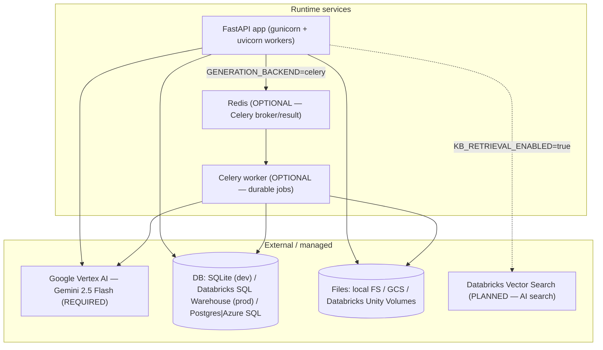
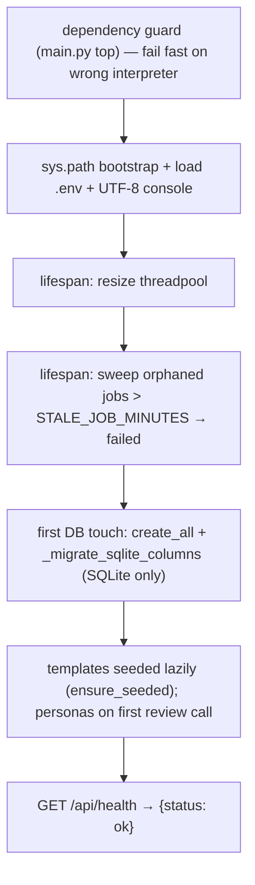
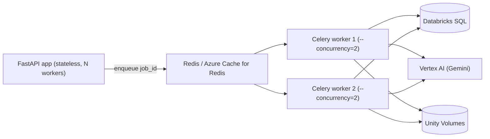
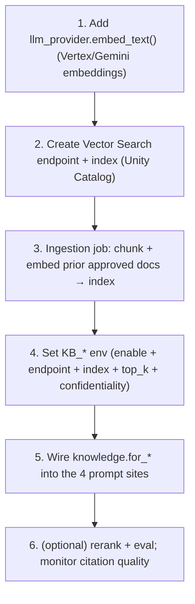

# IntelliDraft — Deployment Design (Detailed)

> Every service the platform uses, how to deploy in each environment (local, Docker, Databricks Apps),
> how to run the generation **jobs/pipelines** durably, and the exact steps to add the **AI-search
> (Databricks Vector Search)** layer. Traceable to `Dockerfile`, `docker-compose.yml`,
> `Data_Ingestion/app.yaml`, `scripts/deploy.*`, and the code.

---

## 1. Services & dependencies (what runs, and what's required)



| Service | Required? | Where configured |
|---|---|---|
| **FastAPI app** | ✅ always | `main.py`, `Dockerfile`, `app.yaml` |
| **Google Vertex AI (Gemini)** | ✅ always | `key.json` / `GOOGLE_APPLICATION_CREDENTIALS_JSON`, `llm_provider.py` |
| **Database** | ✅ always | `LOCAL_DB`/`DATABASE_URL`/`DATABRICKS_MODE` (`db.py`) |
| **Object storage** | ✅ always | `LOCAL_MODE`/`GCS_BUCKET_NAME`/`DATABRICKS_VOLUME_PATH` (`storage/*`) |
| **Redis** | ⛔ only for `GENERATION_BACKEND=celery` | `CELERY_BROKER_URL` |
| **Celery worker** | ⛔ only for durable jobs | `docker-compose` `--profile celery` |
| **Databricks Vector Search** | ⛔ planned (AI search) | `KB_*` env, `knowledge.py` |

> **Not used anymore:** LibreOffice (removed — preview is pure-Python), Azure OpenAI (no code path),
> Cosmos DB (replaced by a JSON index blob), Vertex AI Agent Engine (retired).

---

## 2. Environment 1 — Local native (dev)

```bash
# Windows: enable Long Paths once (Administrator) — litellm needs it:
#   New-ItemProperty -Path "HKLM:\SYSTEM\CurrentControlSet\Control\FileSystem" `
#     -Name LongPathsEnabled -Value 1 -PropertyType DWORD -Force
python -m venv env
env\Scripts\Activate.ps1                        # source env/bin/activate on *nix
pip install -r Data_Ingestion/requirements.txt
cp Data_Ingestion/.env.example Data_Ingestion/.env
# place a GCP service-account key at Data_Ingestion/key.json
python Data_Ingestion/main.py                   # http://localhost:7071  (Swagger /docs)
```
Defaults: `LOCAL_DB=true`, `LOCAL_MODE=true` → SQLite + local files, no cloud. SQLite auto-redirects out
of OneDrive to `%LOCALAPPDATA%\Intellidraft`. Optional ADK chat: `adk web` (repo root) → `:8000`.

**Smoke test:**
```bash
curl http://localhost:7071/api/health      # {"status":"ok"}
```

---

## 3. Environment 2 — Docker / self-host

`Dockerfile` = single `python:3.11-slim` stage; builds wheels, **purges gcc/g++** after, runs:
```
gunicorn --workers=2 --worker-class=uvicorn.workers.UvicornWorker --bind=0.0.0.0:${PORT:-7071} --timeout=200 main:app
```
Healthcheck hits `/api/health`. `pywin32` is stripped on Linux.

### 3.1 Default (in-process thread generation)
```bash
docker compose up -d --build          # → http://localhost:7071
```
Persists SQLite + parsed docs in the `intellidraft_storage` volume; mounts `key.json` read-only. Env in
compose: `PORT=7071`, `GENERATION_CONCURRENCY=6`, `THREADPOOL_TOKENS=80`.

### 3.2 Durable queue (Celery + Redis)
```bash
# set GENERATION_BACKEND=celery in Data_Ingestion/.env, then:
docker compose --profile celery up -d --build
```
Brings up **three** services (`docker-compose.yml`): the API, a **Redis** broker
(`redis:7-alpine`, appendonly persistence), and a **worker** (same image) running:
```
celery -A generation.celery_app worker --loglevel=INFO --concurrency=2
```
API and worker share the storage volume + `key.json`; both point at `redis://redis:6379/0`. `--concurrency`
= documents per worker (keep 2–4; each doc still fans out `GENERATION_CONCURRENCY` section threads).

---

## 4. Environment 3 — Databricks Apps (production)

Config: `Data_Ingestion/app.yaml`.
```yaml
command: [gunicorn, main:app, --workers, "4", --bind, "0.0.0.0:${DATABRICKS_APP_PORT}",
          --timeout, "200", --worker-class, uvicorn.workers.UvicornWorker]
env:
  LOCAL_DB=false   LOCAL_MODE=false   DATABRICKS_MODE=true
  DATABRICKS_CATALOG=adani_ael_ailabs_catalog_dev
  DATABRICKS_SCHEMA=document-generator
  DATABRICKS_VOLUME_PATH=/Volumes/.../intellidraft-volume
```

### 4.1 Auth model — no PAT (service-principal OAuth M2M)
Inside a Databricks App, `DATABRICKS_CLIENT_ID` / `DATABRICKS_CLIENT_SECRET` are injected automatically.
`db._make_databricks_oauth_engine()` builds a `databricks://:@host?http_path=…&catalog=…&schema=…`
engine from parts when `DATABASE_URL` is unset and `DATABRICKS_MODE=true`. **Do not set `DATABASE_URL`
or `DATABRICKS_TOKEN`.** Storage uses `DatabricksVolumeStorageService` (Unity Catalog Volumes via
`WorkspaceClient`, auto-authenticated).

### 4.2 Set in the Apps UI after first deploy (sensitive — never in `app.yaml`)
`DATABRICKS_SERVER_HOSTNAME` (no `https://`), `DATABRICKS_HTTP_PATH` (`/sql/1.0/warehouses/<id>`),
`VERTEX_AI_PROJECT`, `VERTEX_AI_LOCATION`, `GOOGLE_APPLICATION_CREDENTIALS_JSON` (full SA JSON).

### 4.3 One-time grants for the App's service principal
```sql
GRANT USE CATALOG ON CATALOG adani_ael_ailabs_catalog_dev TO `<app-sp>`;
GRANT USE SCHEMA, CREATE TABLE, MODIFY, SELECT
  ON SCHEMA adani_ael_ailabs_catalog_dev.`document-generator` TO `<app-sp>`;
GRANT READ VOLUME, WRITE VOLUME
  ON VOLUME adani_ael_ailabs_catalog_dev.`document-generator`.`intellidraft-volume` TO `<app-sp>`;
-- plus "Can use" on the SQL Warehouse (Warehouse → Permissions)
```

### 4.4 Deploy
```bash
databricks apps deploy intellidraft-api --source-code-path /Workspace/Users/<email>/intellidraft-api
```
Helper scripts: `scripts/deploy.ps1` / `scripts/deploy.sh`. Detailed runbook:
`DATABRICKS_DEPLOY_GUIDE.md` / `DATABRICKS_DEPLOY_PROCESS.md`.

### 4.5 Schema management (no Alembic on prod)
The SQLite auto-migrator (`_migrate_sqlite_columns`) does **not** run on Databricks SQL. Apply new
columns manually, e.g.:
```sql
ALTER TABLE document_snapshots ADD COLUMN author STRING;
ALTER TABLE document_snapshots ADD COLUMN html_content STRING;
```

---

## 5. Startup sequence & health (all environments)


- **Health probe:** `GET /api/health` (zero DB cost) — used by Docker HEALTHCHECK and Databricks.
- **Logging:** stdlib logging to stdout, UTF-8-forced; per-request line via middleware; LLM calls log
  model/elapsed/length/usage. No external APM wired in — logs are the signal.

---

## 6. Running the jobs / pipeline (deployment perspective)

Pick a backend with `GENERATION_BACKEND`; section-level parallelism (`GENERATION_CONCURRENCY`) applies
inside every backend.

| Backend | How to run | Durability | Use when |
|---|---|---|---|
| `thread` (default) | nothing extra | ❌ restart orphans jobs (swept to failed) | dev, low volume |
| `subprocess` | nothing extra (`job_runner.py` spawns `python -m generation.job_runner <id>`) | ❌ (but process-isolated) | watch parallel gen locally; mirror a Databricks Job |
| `celery` | Redis + `celery -A generation.celery_app worker` | ✅ acks_late re-queues on crash | production / long docs |
| `sync` | nothing (runs inline) | n/a | debugging / tiny docs |

### 6.1 Recommended production job design

- **API stays stateless** and returns immediately; the client polls `GET /api/generate/{job_id}` or the
  SSE stream. Workers own the heavy generation.
- **Redis in prod:** managed (e.g. Azure Cache for Redis, `rediss://…:6380/0`). Set
  `CELERY_VISIBILITY_TIMEOUT` **greater than the slowest possible document** or Redis re-delivers a
  still-running task.
- **Worker concurrency:** keep 2–4 documents/worker; each document already fans `GENERATION_CONCURRENCY`
  section threads, so oversubscribing risks Vertex 429s (which `llm_provider` retries).
- **Idempotent + safe redelivery:** `_run_generation_job` resets stuck sections and skips completed
  ones, so `task_acks_late` re-runs never double-write.

### 6.2 Databricks-Job alternative (Approach B, no Redis)
`generation/job_runner.py` is a standalone entry point (`python -m generation.job_runner <job_id>`) —
register it as a **Databricks Job (Python task)** with the job_id as a parameter to run one document per
job run. Section parallelism still happens inside. This is the same body the subprocess backend runs
locally.

### 6.3 Tuning knobs
`GENERATION_CONCURRENCY` (sections/wave, default 6) · `THREADPOOL_TOKENS` (sync-route capacity, 80) ·
`STALE_JOB_MINUTES` (orphan sweep, 45) · gunicorn `--workers` (API processes) · Celery `--concurrency`
(docs/worker) · `--timeout 200` (covers the 180s derive/generate LLM timeouts).

---

## 7. How to add AI search (Databricks Vector Search) — deployment steps

> `generation/knowledge.py` is a ready scaffold but **inert** (no site imports it; it needs an
> `embed_text` that doesn't exist yet). This is the operational rollout plan; the code design is in
> [DESIGN_01_GENAI.md §7](DESIGN_01_GENAI.md#7-how-ai-search-rag-will-be-included).



1. **Embeddings function** — implement `embed_text(text) -> list[float]` in `llm_provider.py`
   (embeddings are a different model family from chat). `knowledge._embed` already calls it.
2. **Provision the index** (Databricks SQL Editor / UI or SDK): a Vector Search **endpoint**
   (`KB_ENDPOINT_NAME`, default `intellidraft-vector-endpoint`) and an **index** (`KB_INDEX_NAME`,
   e.g. `adani_ael_ailabs_catalog_dev.knowledge_base_v1.chunks_index`) with columns:
   `chunk_id, document_id, chunk_text, section_title, document_type, project_name,
   source_document_path, created_date, business_unit, confidentiality_level`.
3. **Ingestion pipeline** — a Databricks Job that reads approved documents, chunks them, computes
   embeddings, and upserts into the index (with the metadata above; set `confidentiality_level` per
   document — access control is enforced **in the query** by `knowledge._build_filters`).
4. **Enable via env** (App/compose): `KB_RETRIEVAL_ENABLED=true`, `KB_ENDPOINT_NAME`, `KB_INDEX_NAME`,
   `KB_RETRIEVAL_TOP_K=5`, `KB_CONFIDENTIALITY_DEFAULT=internal`. Grant the App's service principal
   access to the endpoint/index.
5. **Wire the four prompt sites** — import `knowledge.for_generation/for_extraction/for_derivation/
   for_review` and concatenate their block alongside the existing `ontology.for_*` block in
   `generator._build_system_prompt`, `extractor._call_llm`, `derive_fields`, and
   `review_service.ai_persona_review`. All degrade to `""` when disabled, so this is safe to ship dark.
6. **Verify & monitor** — retrieved chunks carry `[source: file · project · date]` citations that the
   **validation agent** can then trace; watch retrieval latency and Vertex embedding quota. Rerank
   (cross-encoder) is an optional later phase.

**Rollback:** set `KB_RETRIEVAL_ENABLED=false` — every assembly returns `""` and the app behaves exactly
as today.

---

## 8. Operational runbook (quick)

| Task | Command / action |
|---|---|
| Health | `curl $HOST/api/health` |
| Watch a job | `curl $HOST/api/generate/<job_id>` (or the SSE `/stream`) |
| Reset dev DB | `POST /api/admin/reset-db` (requires `ENABLE_ADMIN_ENDPOINTS=true`) |
| Refresh templates | edit `templates/*.json` → **restart** (or `POST /api/templates/{id}/reseed`) |
| Refresh ontology | replace `ontology/*.json` → **restart** (`@lru_cache`) |
| Switch to durable jobs | `GENERATION_BACKEND=celery` + run a worker |
| Restrict CORS | `CORS_ALLOW_ORIGINS=https://<host>` |
| Prod schema change | manual `ALTER TABLE …` on Databricks SQL |

## 9. Pre-exposure hardening (see [README_SECURITY.md](README_SECURITY.md))
The API has **no backend auth** today (identity trusted from `X-User-Email`) and **no rate limiting**.
Before any non-internal exposure: validate Entra tokens server-side + enforce roles, put a rate-limiter
in front of generation, sanitize stored/served HTML (`preview/save`), and confirm Vertex AI data
residency matches Adani policy.

---

## 10. Deployment file index

| File | Purpose |
|---|---|
| `Dockerfile` | single-stage Python 3.11 image; gunicorn+uvicorn |
| `docker-compose.yml` | API (+ `--profile celery`: Redis + worker) |
| `Data_Ingestion/app.yaml` | Databricks Apps command + non-sensitive env |
| `scripts/deploy.ps1` / `scripts/deploy.sh` | deploy helpers |
| `DATABRICKS_DEPLOY_GUIDE.md` / `DATABRICKS_DEPLOY_PROCESS.md` | prod runbooks |
| `generation/job_runner.py` | subprocess / Databricks-Job entry point |
| `generation/celery_app.py` + `tasks.py` | durable queue |
| `Data_Ingestion/requirements.txt` | pinned deps (with CVE notes) |
