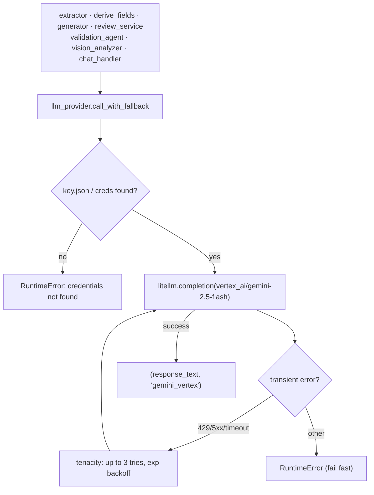
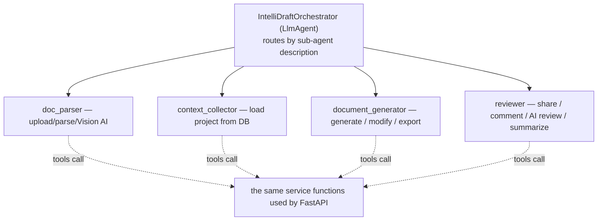

# AI / LLM Pipeline

## 1. The one LLM: Gemini 2.5 Flash via Vertex AI

**Everything** goes through `Data_Ingestion/llm_provider.py`:

- `call_with_fallback(messages, *, max_tokens, timeout, log_prefix, json_mode)` → `(text, "gemini_vertex")`
- `call_vision_with_fallback(text_prompt, base64_data, mime_type, …)` → wraps an image message

Under the hood it calls `litellm.completion(model="vertex_ai/<GEMINI_VERTEX_MODEL>", …)` with the
GCP service-account JSON (default `Data_Ingestion/key.json`) passed as `vertex_credentials`.

- **Model:** `gemini-2.5-flash` (override with `GEMINI_VERTEX_MODEL`); `gemini-2.5-pro` is the
  documented higher-quality alternative. `gemini-1.0-pro` / `gemini-2.0-flash` are marked "do not use".
- **Retries (tenacity):** 3 attempts, exponential jitter (2s→20s), **only** on transient errors
  (HTTP 408/429/500/502/503/504 or Timeout/APIConnection/RateLimit/InternalServer/ServiceUnavailable).
  Auth errors, bad requests, and safety blocks fail fast.
- **`json_mode=True`** sets Vertex `response_format={"type":"json_object"}` — used at **every call site
  whose output is parsed as JSON** (extractor, persona review, validation judge). This is a known
  reliability fix: Gemini otherwise sporadically returns prose on long prompts.

> ⚠️ **There is no Azure/OpenAI fallback in code.** If Gemini fails, callers get a `RuntimeError`
> (which routes surface as HTTP 502). The "Azure GPT-5 fallback" in the root README and several
> docstrings is **not implemented**.

## 2. The four LLM tasks (non-agent)

| Task | Module | Prompt shape | json_mode |
|---|---|---|---|
| **Field extraction** from uploaded docs | `api/extractor.py` | System (analyst) + mapping guidance + ontology + document text → JSON of 12 intake fields | ✅ |
| **Field derivation** (12 extended fields) | `generation/derive_fields.py` | System (architect) + intake data + ontology + doc text → JSON | ✅ |
| **Section generation** | `generation/generator.py` | System template + ontology + source docs + previous-section previews; user prompt = section instructions + spec block | ❌ (prose Markdown) |
| **Vision image description** | `parsers/vision_analyzer.py` | Image + prompt → classified description | (varies) |

### Section generation prompt anatomy (`generator._build_system_prompt`)
The system prompt (`_SYSTEM_TEMPLATE`) assembles, in order:
1. Project info (name, doc type, audience, stakeholders, language)
2. **`{ontology_block}`** — org context + doc-type guidance + matched glossary + matched systems
   (from `ontology.for_generation`)
3. Business context / project description / additional instructions / template style instructions
4. **Source document content** (capped at 8,000 chars per section call)
5. **"Sections already written"** — the first **150 chars** of each previously-generated section
   (coherence signal that stays cheap as sections accumulate)
6. Strict formatting + content-quality rules (Markdown tables must have header rows; expand Adani
   acronyms; no "TBD"/"Lorem ipsum"; enterprise tone)

The user prompt (`_GENERATION_PROMPT` or `_REVISION_PROMPT`) carries the section instructions plus a
`## ADANI TEMPLATE SPECIFICATION` block built by `section_mapping.build_section_guidance()` from the
section's spec fields (`scope_boundary`, `variables`, `format`, `depth`, `remarks`, `source_fields`,
`annexure`). Max output tokens = `target_words × 6`, clamped to [5000, 16000].

## 3. Business ontology grounding (`generation/ontology.py`)

The single grounding module. It loads a **business-owned pack** at `Data_Ingestion/ontology/`
(`@lru_cache`, refreshed by restart):

| File | Content |
|---|---|
| `adani_description.json` | Adani Group / AESL / AEML entity descriptions |
| `document_descriptions.json` | Per-doc-type purpose, required inputs, owner |
| `workflow.json` | The **BRD → NDPR → NFA → NIT → RFP** document chain |
| `terminology.json` | 549-term acronym/domain glossary |
| `key_regulations.json` | Regulatory frameworks (MERC, BEE, DFPO, LIS) |
| `technical_landscape.json` | ~130 tools across the AESL Grid/Retail estate |

**Selective injection is the core discipline** — it never dumps whole files:
- `glossary_block()` — word-boundary matches only the terms that appear in the call's text
  (fast substring pre-reject before regex; ~10ms on a 60K scan; capped ~35–40 terms).
- `tech_landscape_block()` — only systems mentioned in the text (optionally + a domain overview).
- `document_context()` — the doc type's purpose, chain position, inputs, reviewers, risk-if-weak.
- `company_context()` — Adani Group + the entity (AESL/AEML) matched from the text.

Four assemblies, one per prompt site (all fail-soft to `""`):
`for_generation` · `for_extraction` · `for_derivation` · `for_review`.

## 4. RAG scaffold (`generation/knowledge.py`) — ⚠️ INERT

A **Databricks Vector Search** hybrid-retrieval layer intended to inject precedent chunks from
prior approved documents (cited with `[source: …]`, confidentiality-filtered in the query).

**Current status: not wired in and non-functional.**
- No prompt site imports it (grep confirms only `ontology` is imported by the generators).
- It calls `llm_provider.embed_text`, which **does not exist** in `llm_provider.py`.
- All functions are gated by `KB_RETRIEVAL_ENABLED` (default `false`) and fail-soft to `""`.

Treat it as a designed-but-unbuilt Phase-3 feature ("similarity search via Databricks AI Search").

## 5. Review AI (`generation/review_service.py`)

Three LLM-backed features, all through the same provider:

1. **`ai_persona_review(review_id, persona)`** — reviews the document *as* a persona (PM / Technical /
   Business Analyst / Compliance / Financial). Returns JSON `{summary, section_comments[]}` with
   `severity` per comment. Hardened: `json_mode=True`, a **corrective retry** that shows the model its
   own malformed output, `_extract_json()` tolerance, and `_validate_persona_review()` which drops bad
   items and enforces valid `section_id`s. Nothing is persisted until the reviewer "keeps" comments.
2. **`summarize_for_author(review_id, personas, force)`** — persona-wise plain-text summaries of ALL
   reviewer feedback. **Fingerprint-cached**: each summary stores a SHA-256 of the comment set; if
   comments are unchanged it returns the cache without calling the LLM (unless `force=True`).
3. **`apply_comment_to_section(comment_id)`** — the bridge: turns a review comment into
   `add_comment → regenerate_section`, producing a new section version.

## 6. Validation agent (`agents/validation_agent.py`)

A **mostly-deterministic** QA scorer (offline by default; `use_llm=True` adds a Gemini semantic judge).

- **Weighted 0–100 score:** correctness 40 · completeness 20 · format 15 · edge cases 15 · robustness 10.
- **Verdict:** PASS iff score ≥ **80** and no **CRITICAL** finding.
- **Source-document provenance:** every long-text field is traced to the attached document that best
  supports its *salient tokens* (numbers, acronyms, stemmed words); the report carries per-field
  `source_name`, `source_path`, `support` (0–1), and `grounded` flags. Ungrounded content is flagged.
- **`ground_truth=None` mode** (used by `POST /api/generate/{job_id}/validate`): correctness becomes
  pure grounding score — i.e. "how much of this generated doc traces back to the sources".

## 7. ADK multi-agent system (`agents/`) — optional surface

Run with `adk web` (port 8000) from the repo root; **not** on the FastAPI request path.

All agents use one model, chosen in `agents/_model.py` → `get_agent_model()` → Gemini 2.5 Flash
(`GEMINI_MODEL` override). Shared session state (`project_id`, `job_id`, `parsed_document_ids`, …)
is passed through the ADK `InvocationContext`.

## 8. Token / cost / reliability levers

| Lever | Where | Effect |
|---|---|---|
| `GENERATION_CONCURRENCY` (default 6) | `generation_service` | Sections per wave; ~concurrency-fold wall-clock reduction |
| 150-char previous-section previews | `generator._build_system_prompt` | Keeps prompt lean as sections accumulate; makes parallelism quality-neutral |
| 8,000-char context cap per section | `generator.generate_section` | Predictable latency (Gemini has 1M context but it's capped anyway) |
| Selective ontology injection (~1K tokens) | `ontology.py` | Never dumps the 549-term glossary or 25K-token tech landscape |
| Summary fingerprint cache | `review_service` | Avoids re-summarizing unchanged feedback |
| Preview pre-warm | `generation_service._run_generation_job` (end) | Caches HTML preview before the client polls |
| tenacity transient-only retry | `llm_provider` | Retries 429/5xx, fails fast otherwise |
