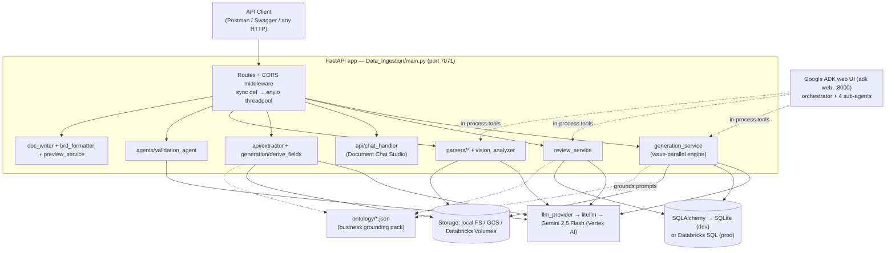
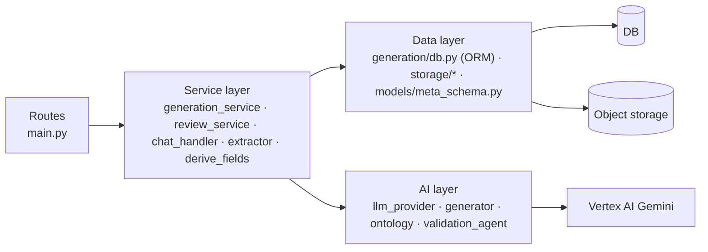

# Architecture Overview

## 1. System context

IntelliDraft is a **single FastAPI application** (`Data_Ingestion/main.py`, ~1,760 lines,
~64 routes) that fronts a document-generation engine, a review workflow, and an optional
Google-ADK multi-agent chat surface. There are no microservices — everything runs in one
process (with an *optional* Celery worker for durable generation).

## 2. Backend architecture

### Request model — deliberately synchronous
Every route is a plain `def` (not `async def`). FastAPI runs sync routes in an **anyio
threadpool** (sized to `THREADPOOL_TOKENS`, default 80 — see `main.py` lifespan). This is a
**deliberate design choice**: the service layer (SQLAlchemy, litellm) is blocking, so keeping
routes sync means blocking calls never stall the event loop. The **only** async route is the SSE
progress stream (`GET /api/generate/{job_id}/stream`), which uses `asyncio.sleep` +
`run_in_threadpool` for DB reads so it holds no thread while idle.

> **Rule (from code comments + memory):** do NOT convert routes to `async def` while the
> services block.

### Layering

There is **no formal dependency-injection framework**. Wiring is done with:
- **Lazy module-level singletons** — `db.get_engine()`, `storage.get_storage_service()`,
  `main._get_store()`, `ontology._load()` (`@lru_cache`), `knowledge._index()` (`@lru_cache`).
- **Function-scoped imports** inside handlers (`from generation.X import Y`) to break import
  cycles and keep cold-start cheap. This pattern is everywhere and is intentional.

### Application lifespan (`main.py` `_lifespan`)
On **startup**: (1) resize the anyio threadpool; (2) **orphaned-job sweep** — any generation job
still `pending`/`in_progress` older than `STALE_JOB_MINUTES` (45) is marked `failed` (jobs run on
in-process threads and don't survive a restart). On **shutdown**: dispose the DB engine to flush
the SQLite WAL.

## 3. AI architecture

Two related but separate AI surfaces:

| Surface | Entry point | Used for |
|---|---|---|
| **Direct LLM calls** | `llm_provider.call_with_fallback()` | 90% of AI work — extraction, derivation, section generation, review, validation, chat impact analysis. All go straight to Gemini. |
| **Google ADK multi-agent** | `agents/orchestrator.py` (`adk web`) | Optional conversational surface. An `LlmAgent` orchestrator routes to 4 sub-agents (`doc_parser`, `context_collector`, `document_generator`, `reviewer`) whose *tools* call the same service functions. Not part of the FastAPI request path. |

See [README_AI_PIPELINE.md](README_AI_PIPELINE.md) for full detail. Key point: the **FastAPI app
does not go through ADK** — chat in the app is handled by the keyword-based `api/chat_handler.py`,
not by an LLM agent.

## 4. Component inventory (verified file map)

| Concern | Module(s) |
|---|---|
| HTTP API | `main.py` |
| Generation engine | `generation/generation_service.py`, `generation/generator.py`, `generation/job_runner.py` |
| Generation backends | thread (default) · subprocess · celery (`celery_app.py`, `tasks.py`) · sync |
| Templates | `generation/template_manager.py`, `templates/*.json`, `generation/section_mapping.py` |
| Prompt grounding | `generation/ontology.py` (+ `ontology/*.json`), `generation/knowledge.py` (RAG scaffold, inert) |
| Extraction / derivation | `api/extractor.py`, `generation/derive_fields.py` |
| Review workflow | `generation/review_service.py` |
| Validation / QA | `agents/validation_agent.py` |
| Chat studio | `api/chat_handler.py` |
| Parsing | `parsers/*.py`, `parsers/vision_analyzer.py`, `models/meta_schema.py` |
| Export / preview | `generation/doc_writer.py`, `generation/brd_formatter.py`, `generation/preview_service.py`, `generation/doc_style.py`, `generation/doc_meta.py` |
| Persistence | `generation/db.py` (ORM + engine + locking) |
| Object storage | `storage/gcs_storage.py` (local + GCS), `storage/databricks_volume_storage.py` |
| LLM access | `llm_provider.py` |
| ADK agents | `agents/orchestrator.py`, `agents/*/agent.py`, `agents/*/tools.py`, `agents/_model.py` |

## 5. What the architecture does NOT have

- **No message queue by default** — generation runs on in-process daemon threads. Celery/Redis is
  strictly opt-in.
- **No cache server** — the only cache is an in-process preview cache (`preview_service`) and
  `@lru_cache` for ontology/config. No Redis-as-cache.
- **No separate auth service** — identity arrives via `X-User-Email` / `X-User-Name` headers
  (Entra SSO is described as a frontend concern; token validation is not implemented in the backend).
- **No vector DB in the active path** — the Databricks Vector Search integration
  (`knowledge.py`) is scaffolded and disabled.
- **No frontend served by the app** — API-only.

## 6. Coupling notes (Phase 10)

- `generation_service.py` is the hub — it is imported by `main.py`, `chat_handler.py`,
  `review_service.py` (via `apply_comment_to_section`), and the ADK `document_generator` tools.
  It is the single source of truth for starting/regenerating/exporting.
- `db.py` is imported nearly everywhere (all models + `get_session` + `retry_on_locked`).
- `ontology.py` is a leaf that four prompt builders depend on — a bug there degrades every LLM call
  (it is designed to fail-soft to `""`).
- `llm_provider.py` is the single choke point for all Gemini traffic (retry/backoff lives here).
