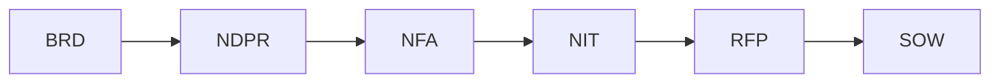
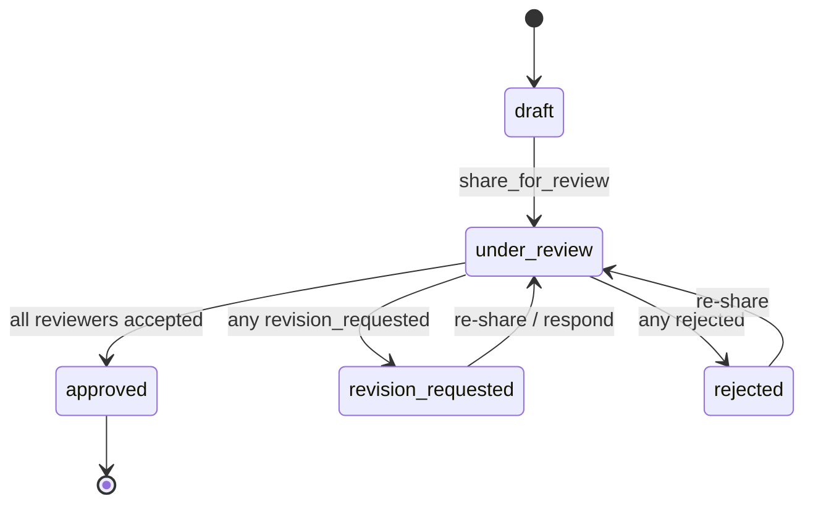

# Business Logic & Domain

## 1. What problem does it solve?

Enterprise project teams at **Adani Energy Solutions (AESL)** must produce a long chain of formal
governance documents for every project. Writing them by hand is slow, inconsistent, and requires
deep knowledge of Adani's terminology, systems, and approval process. IntelliDraft **automates the
drafting** of these documents from uploaded source material + a structured intake form, keeps them
**grounded** in Adani's real ontology (entities, glossary, systems, regulations), and wraps them in
a **review / approval** workflow.

## 2. Who uses it?

- **Authors / Project Managers / Business Analysts** — upload sources, fill the intake form,
  generate and refine documents, share for review, export.
- **Reviewers** (Technical Lead, Compliance, Finance, etc.) — open a review workspace, comment,
  run AI persona reviews, and approve/reject/request revisions.
- **Admins** — manage users and personas.

Roles in the `users` table: **Admin · Project Manager · Contributor · Viewer** (not currently
enforced for authorization — informational).

## 3. The 11 document types and the Adani chain

| Code | Full name | Template |
|---|---|---|
| BRD | Business Requirements Document | `templates/brd.json` |
| NDPR | Non-Detailed Project Report | `ndpr.json` |
| NFA | Note for Approval | `nfa.json` |
| NIT | Notice Inviting Tender | `nit.json` |
| RFP | Request for Proposal | `rfp.json` |
| SOW | Statement of Work | `sow.json` |
| Proposal | Project Proposal | `proposal.json` |
| Tech Spec | Technical Specification | `tech_spec.json` |
| Scope | Scope Document | `scope.json` |
| BOQ | Bill of Quantities | `boq.json` |
| ARB | Architecture Review Board submission | `arb.json` |

**The workflow chain** (encoded in `ontology/workflow.json` and used to ground prompts):

`ontology.document_context()` injects each doc type's **predecessor, required inputs, owner,
reviewers, and "risk if this document is weak"** so the LLM writes for the document's real place in
the governance chain. Doc types outside the chain (SOW/Proposal/TechSpec/Scope/BOQ/ARB) still
generate, just without chain semantics.

## 4. Generate-vs-static section engine (important, non-obvious)

Each section in a template JSON declares a **`mode`**:
- **`generate`** — normal LLM generation.
- **`static`** — no LLM. The section's `static_content` is inserted **verbatim**, with
  `{{placeholders}}` filled from project fields (`_fill_placeholders`; unknown tokens → `__________`).
  Used for legal boilerplate / tender forms (e.g. NIT Section-II/III + Forms extracted verbatim from a
  reference tender). It still lands as a normal `SectionVersion` (trigger_type `static`) so preview /
  download / manual+AI edit / versioning all work identically.

This makes templates a reusable **generate-or-copy engine** for any doc type, not just NIT.

### Section spec fields (per section, in the template JSON)
`section_mapping.build_section_guidance()` turns these into the `ADANI TEMPLATE SPECIFICATION` prompt
block: `scope_boundary` (MUST NOT INCLUDE — stops sections bleeding into each other), `variables`
(exact table columns), `format` (Text/List/Table/Form/Header), `depth` (Detailed/Short), `remarks`,
`source_fields`, `annexure.reference_text`. **Composite sections** (`composite:true` with `subsections`)
generate a parent + all sub-sections in one continuous block (e.g. BRD §4 with §4.1–4.6).

## 5. Document Chat Studio (business rules)

`api/chat_handler.py` is a **keyword-classified** assistant (zero LLM for routing). Rules that matter:
- **"Modify" always beats "generate"** — so "generate: can you modify…" routes to modify.
- **Two-step confirm** for modify/section-updates: instruction → `confirm_modify` → "yes" → regenerate.
  (Note: the keyword classifier treats specific verbs as modify; a phrase like "make it concise" that
  omits a strong-modify keyword may not classify as modify — a known limitation.)
- **Chat is auto-linked to the project's latest job** each message (`_get_or_create`), so edits work
  even though documents are usually generated via the REST endpoint, not the chat.
- **Uploading a file mid-review** runs an LLM **impact analysis** listing which sections should be
  regenerated, then asks to confirm; confirmed updates run in a background thread (new versions).

## 6. Review lifecycle & status rollup

`review_service.respond()` computes the job's `review_status` with **worst-wins** precedence:
any `rejected` → rejected; else any `revision_requested` → revision_requested; else all `accepted`
→ approved (review marked completed); else under_review.

**Dashboard rollup** (`project_review_rollup`): a project is `approved` only if documents exist and
**all** are approved; `under_review` if any doc is under_review/revision_requested/rejected;
otherwise `under_draft`.

## 7. Multi-document-per-project

A project holds **many** documents (one BRD, one NFA, one NIT, …). The **latest completed job per
(project_id, document_type)** is that document's current state. `POST /api/generate/project/{id}` is
**idempotent per doc type** — re-requesting an already-completed type returns the existing job
(`already_complete:true`) instead of regenerating.

## 8. Hidden / non-obvious business rules (embedded in code)

- **Short-table retry:** if a `table` section comes back under 40% of its `target_words`, the
  generator retries **once** with a stronger "output the FULL table with ALL rows" nudge.
- **AEML defaults for NIT placeholders:** `_fill_placeholders` defaults `client_name`/`organisation`/
  `purchaser` to "Adani Electricity Mumbai Limited (AEML)".
- **Business priority vocabulary:** extraction infers one of *Critical / Highly Critical /
  Non-Critical* (defaults Non-Critical).
- **Cost is in Crores INR** (`estimated_cost_crores`, stored as string).
- **System personas cannot be edited or deleted**; the 5 defaults seed on first use.
- **Never notify the actor about their own action** (`_notify` self-check).
- **Acronym discipline:** prompts require expanding Adani acronyms on first use, using the glossary,
  and preferring real AESL systems over invented names.

## 9. Assumptions & constraints

- Source docs must be pdf/doc(x)/ppt(x)/xls(x) (**not txt/csv**), ≤ 50 MB.
- Generation quality depends on the ontology pack being current — updating it means replacing the
  JSONs and restarting (they're `@lru_cache`d).
- Identity is trusted from headers — there is no backend token validation yet.
