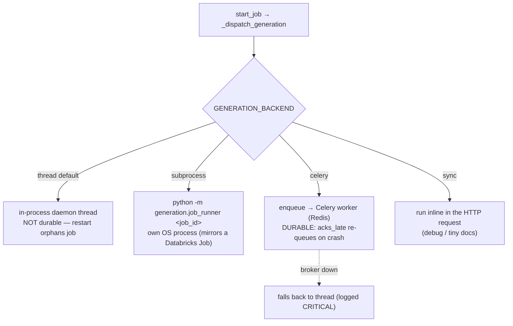

# Deployment Guide

Two supported production targets: **Databricks Apps** (primary) and **Docker/self-host**. Plus
local native dev.

## 1. Local native (dev)

```bash
# Windows PowerShell — enable Long Paths once (litellm needs it), as Administrator:
#   New-ItemProperty -Path "HKLM:\SYSTEM\CurrentControlSet\Control\FileSystem" `
#     -Name LongPathsEnabled -Value 1 -PropertyType DWORD -Force
python -m venv env
env\Scripts\Activate.ps1              # (source env/bin/activate on *nix)
pip install -r Data_Ingestion/requirements.txt
cp Data_Ingestion/.env.example Data_Ingestion/.env
# put a GCP service-account key at Data_Ingestion/key.json
python Data_Ingestion/main.py         # → http://localhost:7071  (Swagger: /docs)
```

Defaults: `LOCAL_DB=true`, `LOCAL_MODE=true` → SQLite + local files, no cloud needed.
Optional ADK chat UI: `adk web` from the repo root → http://localhost:8000.

## 2. Docker / self-host

```bash
docker compose up -d --build          # → http://localhost:7071
```
Single Python-3.11-slim image (`Dockerfile`): builds wheels, purges the compiler toolchain, runs
`gunicorn -k uvicorn.workers.UvicornWorker main:app` (2 workers, 200s timeout). Persists SQLite +
parsed docs in a named volume; mounts `key.json` read-only. Healthcheck hits `/api/health`.

**Durable queue profile** (survives API restart):
```bash
# set GENERATION_BACKEND=celery in Data_Ingestion/.env, then:
docker compose --profile celery up -d --build
```
Starts three services: API + Redis broker + a Celery worker (`celery -A generation.celery_app worker`,
same image). See generation backends below.

## 3. Databricks Apps (production)

Config: `Data_Ingestion/app.yaml`.
```
command: gunicorn main:app --workers 4 --bind 0.0.0.0:$DATABRICKS_APP_PORT
         --timeout 200 --worker-class uvicorn.workers.UvicornWorker
env: LOCAL_DB=false  LOCAL_MODE=false  DATABRICKS_MODE=true
     DATABRICKS_CATALOG / DATABRICKS_SCHEMA / DATABRICKS_VOLUME_PATH
```
- **Auth:** no PAT. The App injects service-principal OAuth creds
  (`DATABRICKS_CLIENT_ID`/`SECRET`); `db.py` builds a `databricks://` engine from parts. Do **not**
  set `DATABASE_URL`/`DATABRICKS_TOKEN`.
- **Set in the Apps UI after first deploy:** `DATABRICKS_SERVER_HOSTNAME`, `DATABRICKS_HTTP_PATH`,
  `VERTEX_AI_PROJECT`, `VERTEX_AI_LOCATION`, `GOOGLE_APPLICATION_CREDENTIALS_JSON`.
- **One-time grants** for the App's service principal: USE CATALOG / USE SCHEMA / CREATE TABLE /
  MODIFY / SELECT on the schema, READ/WRITE VOLUME on the volume, "Can use" on the SQL Warehouse.
- **Schema:** Databricks SQL does **not** run the SQLite auto-migrator — apply new columns with manual
  `ALTER TABLE` (see `DATABRICKS_DEPLOY_GUIDE.md` / `DATABRICKS_DEPLOY_PROCESS.md`).

Deploy scripts: `scripts/deploy.ps1` / `scripts/deploy.sh`.

## 4. Generation backends (how a job actually runs)

Selected by `GENERATION_BACKEND`. Section-level parallelism (`GENERATION_CONCURRENCY`) happens
**inside** the job regardless of backend.



- **thread** — historical default; a restart orphans in-flight jobs (startup sweep marks them failed).
- **subprocess** — `generation/job_runner.py` runs one job in its own process (the same body a
  Databricks Job would run). WAL-safe multi-process on SQLite.
- **celery** — `generation/celery_app.py` + `tasks.py`. Durable: `task_acks_late=True` re-queues on
  worker loss; the job body is idempotent (resets stuck sections, skips completed ones).
- **sync** — inline; `start_job` re-reads and returns the finished job.

## 5. Startup sequence & health

1. Venv/dependency guard (`main.py` top) — fails fast if the wrong interpreter is used.
2. `sys.path` bootstrap + `.env` load + UTF-8 console reconfigure.
3. Lifespan: resize threadpool → sweep orphaned jobs.
4. First DB touch → `get_engine()` → `create_all` + `_migrate_sqlite_columns`.
5. Templates seeded lazily on first `ensure_seeded()`; personas on first review call.
6. **Health:** `GET /api/health` → `{"status":"ok"}` (zero DB cost). Docker/Databricks probe this.

## 6. Logging & monitoring

- Structured stdlib logging to stdout (`%(asctime)s - %(levelname)s - %(name)s - %(message)s`),
  UTF-8-forced console. Per-request line via CORS/log middleware. Gunicorn access log to stdout.
- No external APM/metrics wired in — logs are the primary signal. LLM calls log model, elapsed,
  response length, and token usage at INFO.
